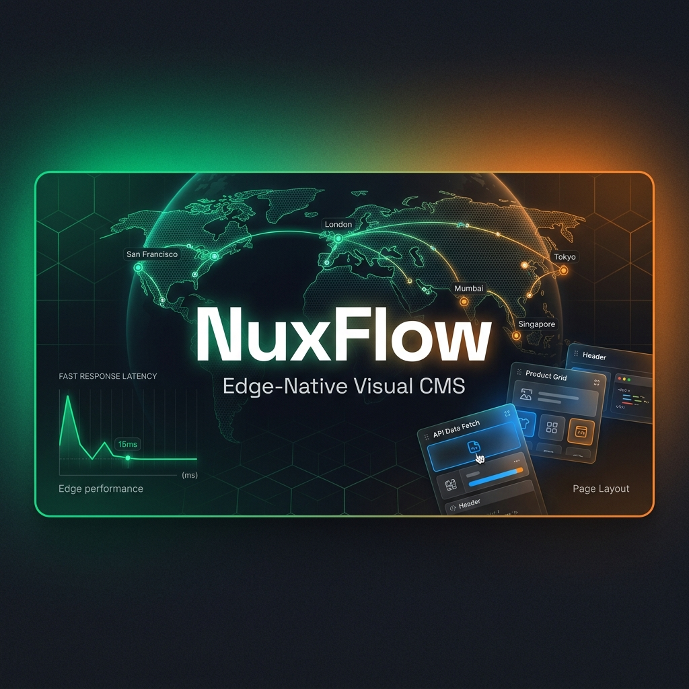

<p align="center">
  
</p>

<h3 align="center">The open-source CMS for the modern, edge-deployed web</h3>

<p align="center">
  Built on Nuxt 4 · Runs on Cloudflare free tier · No config file editing required
</p>

<p align="center">
  <a href="https://github.com/nuxflow/nuxflow/actions/workflows/ci.yml">
    
  </a>
  <a href="https://github.com/nuxflow/nuxflow/blob/main/LICENSE">
    
  </a>
  
  
  
  
</p>

---

NuxFlow is a self-hosted, open-source CMS that gives non-technical users a WordPress-level experience on a modern, serverless stack — with no server to manage, no lock-in, and a free-tier-compatible deployment.

**For users:** A guided onboarding wizard, a block-based page editor, media library, form builder, and a full admin dashboard — no config file editing required.

**For developers:** A Nuxt 4 monorepo with a typed REST + GraphQL API, a plugin SDK, a theme layer system, and a first-class headless mode.

---

## Features

### Content Management
- **Block editor** powered by TipTap (via Nuxt UI Pro `UEditor`) with drag-and-drop reordering
- **Block types**: Paragraph, Heading (H1–H6), Image, Video, Gallery, Ordered/Unordered List, Blockquote, Code, Embed, Button, Divider, Table, Custom HTML, Form embed
- **Content types**: Pages, Posts, custom types defined per site
- **Workflow states**: Draft → Pending Review → Scheduled → Published → Archived
- **Revision history** — point-in-time snapshots with preview and one-click restore
- **Scheduled publishing** — automatic publish at a set time, respects site timezone
- **Shareable preview links** — 48-hour signed URL, no login required
- **Auto-save** — debounced 10-second background save on existing items
- **Content taxonomies** — tags, categories, and admin-defined custom taxonomies
- **Multi-language** — per-item locale assignment via `@nuxtjs/i18n`

### Media Management
- **Drag-and-drop upload** to the media library
- **Provider abstraction** — Cloudflare Images (default), AWS S3 / Backblaze B2, Bunny.net
- **Alt text, caption, and focal point** editor per asset
- **Responsive image delivery** via CDN
- **Video streaming** via Cloudflare Stream
- **Media picker** component embedded in the block editor

### Authentication & Users
- Email/password login with secure hashing via **Better Auth**
- **Social login** — Google and GitHub OAuth
- **Role-based access control**: Super Admin, Admin, Editor, Author, Viewer, plus custom roles
- **Multi-site roles** — users can have different roles on different sites
- Password reset via email (24-hour links)
- **Account locking** after 5 failed attempts, auto-unlock after 30 minutes
- User invitation workflow with role assignment

### Site Settings & SEO
- **Per-item SEO** — meta title, description, canonical URL, Open Graph, Twitter Card, Schema.org structured data
- **Auto-generated XML sitemap** at `/sitemap.xml`
- **Dynamic robots.txt** — editable from the admin
- **301/302 redirect manager** — create and delete redirects from the admin
- **Analytics integration** — Google Analytics, Plausible, Fathom, Cloudflare Web Analytics
- **RSS/Atom feed** at `/feed.xml`

### Forms Builder
- **Multi-step form builder** (Typeform-style)
- **Field types**: Text, Number, Email, File Upload, Select, Radio, Checkbox, Date, Signature, Computed
- **Conditional logic** — "Show field if X equals Y"
- **Computed fields** — real-time expression evaluation (e.g. `{{quantity}} * {{price}}`)
- **Spam protection** via Cloudflare Turnstile
- Submissions stored in database; viewable and **exportable as CSV**
- Optional email notification on submission

### Theme System
- Themes are **Nuxt layers** — override any component, page, or layout
- **Live theme preview** — admin sees new theme while visitors see the current one
- **Instant activation** — new theme takes effect immediately on activation
- Per-block render components defined in the theme
- CLI scaffolding: `npx nuxflow create-theme`

### Plugin System
- Plugins are **Nuxt modules** — add server routes, admin pages, and UI components
- **Declared permissions** — admin approves permissions before activation
- **Error containment** — plugin failures cannot crash the core
- Workers-compatible **build-time registry** maps plugin IDs to bundled entry points
- CLI scaffolding: `npx nuxflow create-plugin`
- **Bundled plugins**: Contact Form, Payments (Stripe / Lemon Squeezy / Paddle)

### Membership & Payments (Payments Plugin)
- **Membership tiers** with recurring subscription pricing
- **Content access gating** — Public / Members Only / Specific Tier
- **Paywall component** shown to non-members
- Payment processors: **Stripe**, **Lemon Squeezy**, **Paddle**
- Webhook handlers for subscription lifecycle events
- Subscriber management admin page

### Multi-Site Management
- One installation manages **unlimited sites** with full data isolation
- Per-site domain, theme, plugins, users, and content
- All database queries scoped by `site_id`
- **Super-admin dashboard** with cross-site stats
- Site creation wizard

### AI Writing Assistant
- LLM providers: **OpenAI**, **Anthropic**, **Google Gemini**, **Ollama** (local, free)
- **Improve** — select text → receive 2–3 alternative rewrites
- **SEO suggestions** — generate meta title and description from content
- **Alt text generation** for media uploads
- AI toolbar only appears when a provider is configured — zero friction when unused

### Headless API
- **REST API v1** — full CRUD on all content types, paginated and filterable
- **GraphQL API** — `graphql-yoga` endpoint at `/api/graphql`
- **API keys** — generate named keys with scoped permissions, revoke anytime
- Bearer token authentication for external consumers
- Unauthenticated requests automatically restricted to published content

### Operations & Developer Experience
- **In-app notifications** — bell icon in admin header for publish, submission, comment events
- **Audit log** — full history of admin actions (who, what, when)
- **Webhook dispatcher** — fires on `content.publish`, `form.submission`, `user.created`
- **Full-text search** — SQLite FTS5, zero external dependency
- **Content export** — JSON or CSV download
- **Maintenance mode** — toggle from settings; shows a customisable holding page
- **Rate limiting** — DB-backed atomic upsert (works across Cloudflare Worker isolates)
- **GDPR cookie consent** — configurable categories, Cloudflare geolocation-aware
- **Comment system** — native threaded comments with auto-moderation for logged-in users
- Scheduled cron task — auto-publishes scheduled content every minute
- CSRF protection, input validation (Zod), security headers

---

## Stack

| Layer | Technology |
|---|---|
| Framework | Nuxt 4 |
| Runtime | Cloudflare Workers (via Nitro `cloudflare-pages` preset) |
| Database | Turso (libSQL / SQLite at the edge) |
| ORM | Drizzle ORM |
| UI | Nuxt UI Pro (TipTap `UEditor`, `UDashboardSidebar`) |
| Auth | Better Auth + `@onmax/nuxt-better-auth` |
| State | Pinia |
| GraphQL | graphql-yoga |
| Validation | Zod |
| Animations | Motion Vue |
| i18n | @nuxtjs/i18n |
| SEO | nuxt-seo-utils |
| Monorepo | pnpm workspaces + Turborepo |
| Testing | Vitest + Playwright |

---

## Project Structure

```
nuxflow/
├── apps/nuxflow/               # Main Nuxt 4 application
│   ├── app/
│   │   ├── pages/admin/        # Admin dashboard pages
│   │   ├── pages/setup/        # Onboarding wizard
│   │   ├── components/         # Editor, forms, media, setup components
│   │   ├── layouts/            # Admin + public layouts
│   │   └── stores/             # Pinia stores (auth, content, site)
│   └── server/
│       ├── api/v1/             # REST API handlers
│       ├── api/graphql/        # GraphQL endpoint
│       ├── middleware/         # Site resolution, auth, redirects, maintenance
│       ├── plugins/            # Plugin loader, theme resolver
│       ├── routes/             # sitemap.xml, robots.txt, feed.xml
│       ├── scheduled/          # Cron tasks (scheduled publish)
│       └── utils/              # Permissions, audit, rate limiting, providers
├── packages/
│   ├── db/                     # Drizzle schema + migrations + client factory
│   ├── plugin-sdk/             # Types and helpers for plugin authors
│   └── cli/                    # create-plugin and create-theme scaffolding
├── packages/plugins/
│   ├── contact-form/           # Bundled Contact Form plugin
│   └── payments/               # Bundled Payments plugin (Stripe, LS, Paddle)
├── themes/
│   └── default/                # Default theme (Nuxt layer, block renderers)
└── specs/001-nuxflow-cms-platform/  # Specification, data model, API contracts
```

---

## Documentation

For detailed information on how to install and use NuxFlow, please refer to our documentation:

- **[Installation Guide](docs/installation.md)** — Step-by-step setup for local development and Cloudflare deployment.
- **[User Guide](docs/user-guide.md)** — A comprehensive manual for managing content and site settings.
- **[Documentation Index](docs/index.md)** — The entry point for all documentation.

---

## Getting Started

### Prerequisites

| Tool | Version | Install |
|---|---|---|
| Node.js | 20+ | `nvm install 20` |
| pnpm | 9+ | `npm install -g pnpm` |
| Turso CLI | latest | `curl -sSfL https://get.tur.so/install.sh \| bash` |
| Wrangler | 3+ | `pnpm add -g wrangler` |

### 1. Clone and install

```bash
git clone https://github.com/nuxflow/nuxflow.git
cd nuxflow
pnpm install
```

### 2. Create a Turso database

```bash
turso db create nuxflow-dev
turso db show nuxflow-dev --url       # copy the URL
turso db tokens create nuxflow-dev    # copy the token
```

For local development you can also use the bundled SQLite file — skip this step and set `NUXT_TURSO_URL=file:../../packages/db/local.db` with no auth token.

### 3. Configure environment

```bash
cp apps/nuxflow/.env.example apps/nuxflow/.env
```

Minimum required variables:

```env
NUXT_TURSO_URL=libsql://your-db.turso.io
NUXT_TURSO_AUTH_TOKEN=your-token
NUXT_BETTER_AUTH_SECRET=at-least-32-random-characters
NUXT_PUBLIC_SITE_URL=http://localhost:3000
```

See [Environment Variables](#environment-variables) for the full reference.

### 4. Run migrations

```bash
pnpm --filter @nuxflow/db migrate
```

### 5. Start the dev server

```bash
pnpm dev
```

Open `http://localhost:3000/setup` — the onboarding wizard walks through the remaining configuration. No config file editing required.

---

## Deployment

### Cloudflare Workers / Pages

```bash
# Log in to Cloudflare
wrangler login

# Set secrets
wrangler secret put NUXT_TURSO_AUTH_TOKEN
wrangler secret put NUXT_BETTER_AUTH_SECRET

# Build and deploy
pnpm build
pnpm --filter @nuxflow/app deploy
```

The `wrangler.toml` in `apps/nuxflow/` is preconfigured with the `nodejs_compat` compatibility flag and the scheduled cron trigger for auto-publishing.

### Vercel

Vercel is a supported alternative. Set the same environment variables in the Vercel dashboard. Point the root directory to `apps/nuxflow`.

---

## Environment Variables

All variables are prefixed `NUXT_` and set in `apps/nuxflow/.env` (development) or your hosting provider's secret store (production).

| Variable | Required | Description |
|---|---|---|
| `NUXT_TURSO_URL` | ✅ | `libsql://your-db.turso.io` or `file:../../packages/db/local.db` for local dev |
| `NUXT_TURSO_AUTH_TOKEN` | ✅* | Turso JWT token. Not needed for local `file:` URL. |
| `NUXT_BETTER_AUTH_SECRET` | ✅ | Session signing secret — minimum 32 characters |
| `NUXT_PUBLIC_SITE_URL` | ✅ | Full URL including scheme, used in emails and SEO |
| `NUXT_EMAIL_PROVIDER` | | `console` (default) · `resend` · `brevo` · `zepto` · `smtp` |
| `NUXT_RESEND_API_KEY` | | Resend API key (`re_…`) |
| `NUXT_BREVO_API_KEY` | | Brevo API key (`xkeysib-…`) |
| `NUXT_ZEPTO_API_KEY` | | ZeptoMail API key |
| `NUXT_SMTP_HOST` | | SMTP server hostname |
| `NUXT_SMTP_PORT` | | SMTP port (default `587`) |
| `NUXT_SMTP_USER` | | SMTP username |
| `NUXT_SMTP_PASS` | | SMTP password |
| `NUXT_CLOUDFLARE_IMAGES_TOKEN` | | Cloudflare Images API token |
| `NUXT_CLOUDFLARE_ACCOUNT_ID` | | Cloudflare account ID |
| `NUXT_CLOUDFLARE_IMAGES_DELIVERY_URL` | | Image delivery base URL |
| `NUXT_PUBLIC_CLOUDFLARE_IMAGES_DELIVERY_URL` | | Same value, exposed to the client |
| `NUXT_PUBLIC_TURNSTILE_SITE_KEY` | | Cloudflare Turnstile public site key |
| `NUXT_STRIPE_SECRET_KEY` | | Payments plugin — Stripe secret key |
| `NUXT_STRIPE_WEBHOOK_SECRET` | | Payments plugin — Stripe webhook signing secret |
| `NUXT_LS_API_KEY` | | Payments plugin — Lemon Squeezy API key |
| `NUXT_LS_STORE_ID` | | Payments plugin — Lemon Squeezy store ID |
| `NUXT_LS_WEBHOOK_SECRET` | | Payments plugin — Lemon Squeezy webhook secret |
| `NUXT_PADDLE_API_KEY` | | Payments plugin — Paddle API key |
| `NUXT_PADDLE_VENDOR_ID` | | Payments plugin — Paddle vendor ID |
| `NUXT_PADDLE_WEBHOOK_PUBLIC_KEY` | | Payments plugin — Paddle Ed25519 public key |

---

## Development Commands

```bash
# Dev server (localhost:3000)
pnpm dev

# Run all unit tests
pnpm test

# Run unit tests in watch mode
pnpm test:watch

# Run end-to-end tests (requires running dev server)
pnpm test:e2e

# TypeScript type-check (all packages)
pnpm typecheck

# Lint
pnpm lint

# Production build
pnpm build

# Preview production build locally
pnpm preview

# Deploy to Cloudflare
pnpm --filter @nuxflow/app deploy

# Run DB migrations
pnpm --filter @nuxflow/db migrate
```

---

## Plugins

Plugins extend NuxFlow with new server routes, admin pages, and UI components. They declare their required permissions upfront; an admin must approve them before activation.

### Bundled plugins

| Plugin | Description |
|---|---|
| **Contact Form** | Multi-step forms with conditional logic, computed fields, Turnstile spam protection, CSV export |
| **Payments** | Membership tiers, content gating, Stripe / Lemon Squeezy / Paddle, subscriber management |

### Creating a plugin

```bash
npx nuxflow create-plugin my-plugin
```

This scaffolds a Nuxt module with a `nuxflow.plugin.ts` manifest, server API routes, and admin components. See [CONTRIBUTING.md](CONTRIBUTING.md) for the full plugin authoring guide.

---

## Themes

Themes are [Nuxt layers](https://nuxt.com/docs/guide/going-further/layers) — they can override any component, page, layout, or asset. The active theme is loaded per request; switching themes is instant and does not affect live visitors until Activate is clicked.

### Default theme

`themes/default/` includes block renderer components for every built-in block type. Fork it to create your own theme.

### Creating a theme

```bash
npx nuxflow create-theme my-theme
```

---

## Contributing

Contributions of all kinds are welcome — bug fixes, features, documentation, and plugin/theme submissions.

See [CONTRIBUTING.md](CONTRIBUTING.md) for the full guide including branch naming, commit conventions, and how to submit a pull request.

---

## Security

Found a vulnerability? Please do not open a public issue. See [SECURITY.md](SECURITY.md) for the responsible disclosure process.

---

## License

MIT — see [LICENSE](LICENSE).
